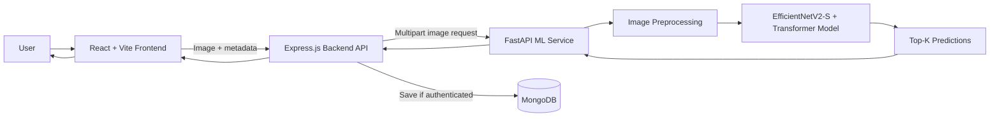
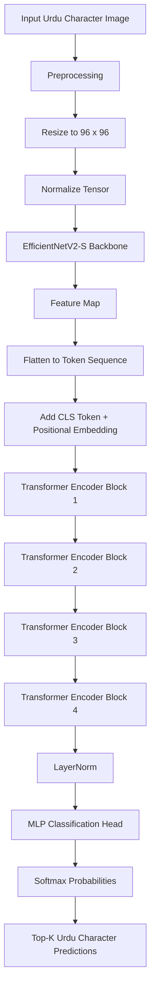
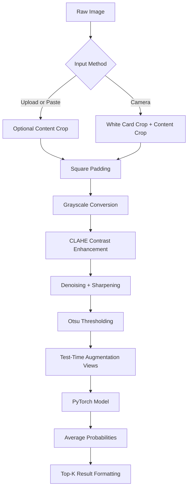
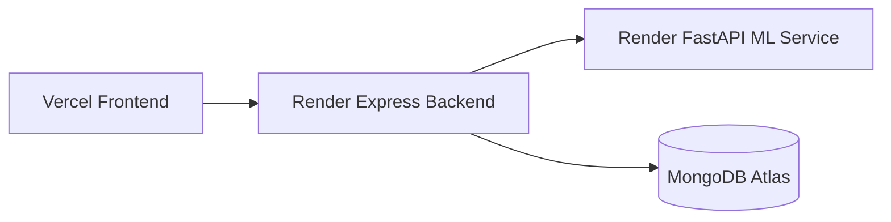

# Urdu OCR - Deep Learning Based Urdu Character Recognition System

An end-to-end OCR application for recognizing Urdu characters from images. The project combines a custom PyTorch vision model, a FastAPI inference microservice, an Express/MongoDB backend, and a React dashboard to deliver real-time Urdu character recognition through a clean web interface.

The system is designed around the challenges of Urdu script: visually similar characters, dots and diacritics, right-to-left writing, and multiple writing styles such as Naskh, Nastaleeq, and Tehreer.

---

## Table of Contents

- [Project Overview](#project-overview)
- [Why This Project Matters](#why-this-project-matters)
- [Key Features](#key-features)
- [Dataset Overview](#dataset-overview)
- [System Architecture](#system-architecture)
- [Machine Learning Model](#machine-learning-model)
- [Inference Pipeline](#inference-pipeline)
- [Tech Stack](#tech-stack)
- [Backend API](#backend-api)
- [Database Design](#database-design)
- [Project Structure](#project-structure)
- [Getting Started](#getting-started)
- [Environment Variables](#environment-variables)
- [Deployment](#deployment)
- [Results](#results)
- [Limitations](#limitations)
- [Future Scope](#future-scope)

---

## Project Overview

Urdu OCR is a full-stack machine learning project that identifies Urdu characters from uploaded, pasted, or camera-captured images. The frontend gives users an interactive recognition experience, the backend handles authentication and prediction history, and the ML service performs image preprocessing and model inference.

At its core, the OCR engine uses a hybrid neural network:

- EfficientNetV2-S for visual feature extraction
- Transformer encoder blocks for attention-based feature refinement
- MLP classification head for 208 Urdu character classes
- Test-time augmentation for more stable predictions
- OpenCV/Pillow preprocessing for camera and upload robustness

The current product workflow focuses on isolated Urdu character recognition. The ML service also includes segmentation-based support for word and line recognition, making the project extensible beyond character-level OCR.

---

## Why This Project Matters

OCR for Latin scripts is mature, but Urdu OCR is significantly harder because Urdu characters are visually complex and often differ by very small marks. A model must learn fine-grained visual patterns such as dot placement, stroke curvature, character shape, font variation, and writing style.

This project demonstrates how machine learning can be integrated into a real application instead of stopping at a notebook. It covers the complete engineering path:

- Dataset understanding
- Deep learning model design
- Model checkpoint loading
- Image preprocessing
- REST API inference
- Authentication
- Database persistence
- Frontend UX
- Deployment-ready service separation

---

## Key Features

| Feature | Description |
| --- | --- |
| Urdu character recognition | Predicts the most likely Urdu character from an image. |
| Top-K predictions | Shows multiple candidate characters with confidence scores. |
| Multiple input methods | Supports file upload, drag-and-drop, camera capture, and clipboard paste. |
| Writing style metadata | Lets users tag input style as Naskh, Nastaleeq, or Tehreer. |
| Image preprocessing | Handles resizing, grayscale conversion, enhancement, cropping, binarization, and normalization. |
| Test-time augmentation | Averages predictions across rotated and scaled views for more robust inference. |
| User authentication | JWT-based login and signup flow. |
| Prediction history | Authenticated users can save and review previous OCR results. |
| Service-based architecture | React frontend, Express backend, MongoDB database, and FastAPI ML service are separated. |
| Deployment ready | Includes Render and Vercel configuration files. |

---

## Dataset Overview

The model is built for the MMU-OCR-21 Urdu OCR dataset, a dataset designed for Urdu character recognition research.

### Dataset Characteristics

| Property | Details |
| --- | --- |
| Dataset | MMU-OCR-21 |
| Task | Urdu character classification |
| Number of classes | 208 |
| Script | Urdu |
| Writing styles represented | Naskh, Nastaleeq, Tehreer |
| Input type | Character images |
| Output type | Character class label |

### Why This Dataset Is Important

Urdu characters can appear very different across fonts and handwriting styles. A dataset with multiple writing styles helps the model learn features that generalize beyond a single font.

The dataset is useful for:

- Fine-grained Urdu character classification
- Font/style variation learning
- Research on non-Latin OCR
- Building character-level OCR systems
- Extending toward word-level and line-level recognition

### Dataset Challenges

- Many Urdu characters are visually similar.
- Small dots can completely change the label.
- Characters may appear differently in printed and handwritten styles.
- Nastaleeq is highly cursive and visually dense.
- Image quality can vary depending on scanning, camera capture, and contrast.

---

## System Architecture

The application uses a modular architecture so that the web app, backend, database, and ML inference service can be developed and deployed independently.



### High-Level Flow

1. User uploads, captures, drags, or pastes an image.
2. React frontend previews the image and sends it to the Express API.
3. Express forwards the image to the FastAPI ML service.
4. FastAPI preprocesses the image and runs PyTorch inference.
5. The model returns the top predicted Urdu characters with confidence scores.
6. Express returns the result to the frontend.
7. If the user is authenticated, the prediction is saved in MongoDB.

---

## Machine Learning Model

The OCR engine is implemented in `ml-service/inference.py`.

### Model Summary

| Component | Role |
| --- | --- |
| EfficientNetV2-S backbone | Extracts deep visual features from character images. |
| CLS token | Aggregates image-level representation for classification. |
| Positional embeddings | Preserve spatial feature order before transformer processing. |
| 4 Transformer blocks | Refine features using multi-head self-attention. |
| Layer normalization | Stabilizes transformer output. |
| MLP classification head | Maps learned features to 208 Urdu classes. |

### Architecture Diagram



### Why EfficientNetV2-S?

EfficientNetV2-S is a strong image feature extractor with a good balance between accuracy and computational cost. It is well suited for this project because the model needs to capture fine character details while still being practical for a web inference service.

### Why Add a Transformer?

The transformer layer helps the model reason over relationships between extracted visual regions. For Urdu characters, small local differences such as dots, curves, and stroke endings can change the final class. Self-attention helps the classifier weigh these regions more effectively.

### Why Top-K Predictions?

Urdu characters can be ambiguous when an image is blurry or a dot is missing. Returning the top 5 predictions gives users interpretable alternatives instead of only one hard label.

---

## Inference Pipeline

The inference pipeline is designed to make uploaded and camera images more model-friendly.



### Preprocessing Steps

- Converts input images to RGB.
- Crops large borders when the content occupies a small portion of the image.
- Pads images to a square canvas.
- Converts to grayscale while keeping three channels for the model.
- Resizes to 96 x 96 pixels.
- Normalizes pixel values.
- Enhances contrast using CLAHE.
- Uses Otsu thresholding for clearer foreground/background separation.

### Test-Time Augmentation

During prediction, the service creates deterministic augmented views:

- Original view
- Rotated views at small positive and negative angles
- Slightly smaller padded view
- Slightly larger center-cropped view

The model predicts on each view, and the probabilities are averaged. This improves stability for slightly tilted or imperfect images.

### Word and Line Extension

The file `ml-service/segmentation.py` contains OpenCV-based segmentation utilities for:

- Character segmentation
- Text-line segmentation
- Word segmentation inside a line

The frontend currently uses character mode as the main user workflow, but the ML service exposes `character`, `word`, and `line` modes internally.

---

## Tech Stack

### Frontend

| Technology | Purpose |
| --- | --- |
| React 18 | Component-based frontend |
| Vite | Fast development and production build |
| Tailwind CSS | Styling and responsive UI |
| Framer Motion | UI animations |
| Lucide React | Icons |
| Axios | API communication |
| React Router | Page routing |

### Backend

| Technology | Purpose |
| --- | --- |
| Node.js | JavaScript runtime |
| Express.js | REST API server |
| MongoDB | Prediction history and users |
| Mongoose | MongoDB object modeling |
| JWT | Authentication |
| bcryptjs | Password hashing |
| multer | Image upload handling |
| form-data | Forwarding image requests to ML service |

### Machine Learning Service

| Technology | Purpose |
| --- | --- |
| Python | ML service language |
| FastAPI | Model serving API |
| PyTorch | Neural network inference |
| torchvision | Image transforms |
| timm | EfficientNetV2-S backbone |
| OpenCV | Image preprocessing and segmentation |
| Pillow | Image loading and conversion |
| NumPy | Array processing |
| Uvicorn | ASGI server |

### Deployment

| Platform/File | Purpose |
| --- | --- |
| Vercel | Frontend deployment |
| Render | Backend and ML service deployment |
| `render.yaml` | Render service blueprint |
| `vercel.json` | Vercel routing configuration |
| `ml-service/build.sh` | Optional checkpoint download and ML dependency setup |

---

## Backend API

### Application Endpoints

| Method | Endpoint | Auth | Description |
| --- | --- | --- | --- |
| `GET` | `/api/health` | No | Checks backend, ML service readiness, and database status. |
| `POST` | `/api/predict` | Optional | Sends an image for OCR prediction. Saves history if logged in. |
| `GET` | `/api/history` | Yes | Returns user-specific prediction history. |
| `GET` | `/api/history/stats` | Yes | Returns total saved predictions for the user. |
| `DELETE` | `/api/history` | Yes | Clears user-specific prediction history. |
| `POST` | `/api/auth/register` | No | Creates a new account. |
| `POST` | `/api/auth/login` | No | Logs in and returns a JWT token. |
| `GET` | `/api/auth/me` | Yes | Returns current authenticated user. |

### ML Service Endpoints

| Method | Endpoint | Description |
| --- | --- | --- |
| `GET` | `/health` | Checks whether the model checkpoint is loaded. |
| `GET` | `/info` | Returns number of classes, device, and supported modes. |
| `POST` | `/predict` | Runs OCR inference on an uploaded image. |

### Example Prediction Response

```json
{
  "mode": "character",
  "text": "character",
  "top_char": "character",
  "top_confidence": 98.42,
  "predictions": [
    { "rank": 1, "char": "character", "confidence": 98.42 },
    { "rank": 2, "char": "alternative", "confidence": 0.91 }
  ],
  "characters": [
    { "char": "character", "confidence": 98.42, "index": 0 }
  ],
  "segment_count": 1
}
```

Note: The actual Urdu characters are returned by the model at runtime. The example above uses placeholder text so the README remains encoding-safe across terminals.

---

## Database Design

MongoDB stores users and prediction history.

### User Model

| Field | Purpose |
| --- | --- |
| `name` | User display name |
| `email` | Unique login identifier |
| `password` | Hashed password using bcrypt |
| `createdAt` / `updatedAt` | Audit timestamps |

### Prediction Model

| Field | Purpose |
| --- | --- |
| `user` | Reference to the authenticated user |
| `mode` | Recognition mode: character, word, or line |
| `recognizedText` | Final OCR output |
| `topChar` | Highest-confidence character |
| `topConfidence` | Confidence score for the top prediction |
| `predictions` | Top-K candidate list |
| `characters` | Segmented character-level results |
| `segmentCount` | Number of detected segments |
| `fontStyle` | User-selected style metadata |
| `inputMethod` | Upload, camera, or paste |
| `imageName` | Original uploaded file name |
| `createdAt` / `updatedAt` | Audit timestamps |

---

## Project Structure

```text
Urdu_OCR_Project/
|-- client/
|   |-- src/
|   |   |-- api/
|   |   |-- components/
|   |   |-- context/
|   |   |-- pages/
|   |   |-- utils/
|   |   |-- App.jsx
|   |   `-- main.jsx
|   |-- package.json
|   |-- tailwind.config.js
|   `-- vite.config.js
|
|-- server/
|   |-- config/
|   |-- middleware/
|   |-- models/
|   |-- routes/
|   |-- index.js
|   `-- package.json
|
|-- ml-service/
|   |-- checkpoints/
|   |   `-- best_model.pth
|   |-- inference.py
|   |-- main.py
|   |-- segmentation.py
|   |-- requirements.txt
|   `-- build.sh
|
|-- DEPLOYMENT.md
|-- README.md
|-- package.json
|-- render.yaml
`-- vercel.json
```

---

## Getting Started

### Prerequisites

Install the following:

- Node.js 18+
- npm
- Python 3.10+ or 3.11
- MongoDB local instance or MongoDB Atlas connection string
- Git

For GPU inference, install a CUDA-compatible PyTorch build. CPU inference also works, but it can be slower.

### 1. Clone the Repository

```bash
git clone https://github.com/HarshiniV06/Urdu-OCR.git
cd Urdu-OCR
```

### 2. Install Frontend and Backend Dependencies

```bash
npm run install:all
```

Or install separately:

```bash
cd client
npm install

cd ../server
npm install
```

### 3. Install ML Service Dependencies

```bash
cd ml-service
pip install -r requirements.txt
```

Make sure the model checkpoint exists at:

```text
ml-service/checkpoints/best_model.pth
```

### 4. Start the ML Service

```bash
cd ml-service
uvicorn main:app --host 0.0.0.0 --port 8000
```

Health check:

```text
http://localhost:8000/health
```

### 5. Start the Backend

```bash
cd server
npm run dev
```

Backend health check:

```text
http://localhost:5000/api/health
```

### 6. Start the Frontend

```bash
cd client
npm run dev
```

Frontend URL:

```text
http://localhost:5173
```

---

## Environment Variables

### Backend (`server`)

Create a `.env` file inside `server/`.

```env
PORT=5000
MONGODB_URI=mongodb://127.0.0.1:27017/urdu_ocr
ML_SERVICE_URL=http://localhost:8000
JWT_SECRET=replace-with-a-long-random-secret
```

### Frontend (`client`)

Create a `.env` file inside `client/` only if the backend is not served from the same origin.

```env
VITE_API_BASE_URL=http://localhost:5000/api
```

### ML Service (`ml-service`)

Optional variables:

```env
ML_PORT=8000
CHECKPOINT_PATH=ml-service/checkpoints/best_model.pth
MODEL_DOWNLOAD_URL=https://example.com/best_model.pth
```

`MODEL_DOWNLOAD_URL` is used by `ml-service/build.sh` when deploying without committing the checkpoint directly.

---

## Deployment

The project is prepared for a split deployment:

- Frontend on Vercel
- Backend on Render
- ML service on Render
- MongoDB on MongoDB Atlas or Render-managed database

### Deployment Flow



For detailed deployment steps, see `DEPLOYMENT.md`.

Important deployment variables:

- `VITE_API_BASE_URL` must point to the deployed backend `/api`.
- `ML_SERVICE_URL` must point to the deployed FastAPI ML service.
- `MONGODB_URI` must point to MongoDB.
- `JWT_SECRET` must be set to a strong production secret.
- The ML checkpoint must be present or downloadable during deployment.

---

## Results

The current README and project documentation describe the model as trained for:

| Metric | Value |
| --- | --- |
| Dataset | MMU-OCR-21 |
| Classes | 208 Urdu character classes |
| Primary task | Character-level recognition |
| Supported input styles | Naskh, Nastaleeq, Tehreer |
| Model family | EfficientNetV2-S + Transformer |
| Output | Top-K character predictions with confidence |

The previous project notes mention approximately:

- Top-1 accuracy: around 72.9%
- Top-5 accuracy: around 99.5%

These values should be presented as validation results from the training workflow. If you publish this project, include the exact evaluation script, split details, and checkpoint metadata so reviewers can reproduce the numbers.

---

## Limitations

- The main user-facing workflow is character-level OCR.
- Word and line recognition rely on classical segmentation, which can be sensitive to image quality.
- Camera photos can introduce blur, glare, skew, and shadows.
- Similar-looking Urdu characters may still be confused when dots or strokes are unclear.
- The model depends on the quality and diversity of the training dataset.
- Render free-tier services may sleep or respond slowly during cold starts.

---

## Future Scope

Planned improvements and extensions:

- Improve word-level and line-level Urdu OCR accuracy.
- Add a dedicated sequence model such as CRNN, TrOCR, or Vision Transformer encoder-decoder for full text recognition.
- Add bounding-box visualization for segmented words and characters.
- Add confidence calibration and uncertainty warnings.
- Add batch OCR for multiple images.
- Add ONNX export for faster CPU inference.
- Add Docker support for simpler deployment.
- Add automated test coverage for API routes and ML preprocessing.
- Add an evaluation dashboard for per-class accuracy and confusion matrix.
- Support multilingual OCR for Urdu, Arabic, Persian, and Hindi.

---
